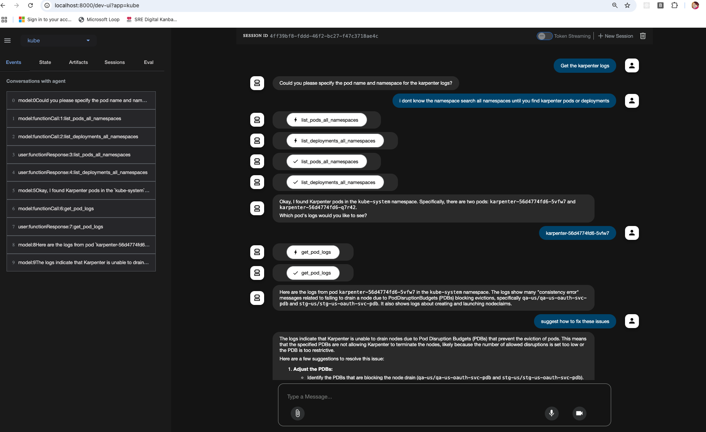

# Kubernetes Assistant Agent

A Google Agent Development Kit (ADK) powered assistant that interacts with Kubernetes clusters to provide information about resources.

 

## Overview

This repository contains a Kubernetes Assistant Agent built with Google's Agent Development Kit (ADK) that can help you manage and monitor your Kubernetes clusters through natural language conversations. The agent leverages the Google Gemini model to understand user queries and uses Kubernetes API functions to retrieve information from your cluster.

## Features

The Kubernetes Assistant can:

- List all namespaces in your Kubernetes cluster
- List deployments, pods, services, secrets, daemonsets, and configmaps in a specific namespace
- Retrieve all major resources (deployments, pods, services, secrets, daemonsets, configmaps) in a specific namespace
- Get detailed information about deployments and pods
- Scale deployments to desired replica counts
- Retrieve pod logs for debugging
- Monitor resource health status (pods and deployments)
- Get cluster events for a specific namespace or across all namespaces with configurable limits

## Prerequisites

- Python 3.10+
- Google API key for Gemini access (https://aistudio.google.com/apikey)
- Kubernetes configuration file set up on your machine
- Required Python packages:
  - `google-adk`
  - `kubernetes>=28.1.0`
  - `python-dateutil>=2.8.2`

## Installation

1. Clone this repository:
   ```bash
   git clone https://github.com/serkanhaytac/google-adk-kubernetes.git
   cd google-adk-kubernetes
   ```
2. Create a virtual environment and activate it:
   ```bash
   python -m venv venv
   source venv/bin/activate
   ```
3. Install the required dependencies:
   ```bash
   pip install -r requirements.txt
   ```

4. Set up your Google API key:
   ```bash
   export GOOGLE_API_KEY="your-api-key"
   ```

5. Ensure your Kubernetes configuration is properly set up and accessible.

## Usage

Run the agent using the following command:

```bash
adk web
```

This will start the agent in web mode, allowing you to interact with it through a web interface on localhost:8000.

## Structure

- `kube/`
  - `agent.py`: Contains the agent code
  - `tools/`
    - `__init__.py`
    - `tools.py`: Contains Kubernetes API functions used by the agent
  - `__init__.py`: Package initialization file
- `requirements.txt`: Lists all required Python packages
- `README.md`: This documentation file


## Available Functions

### Resource Listing
- `list_namespaces()`: List all namespaces in the cluster
- `list_deployments_from_namespace(namespace)`: List deployments in a namespace
- `list_pods_from_namespace(namespace)`: List pods in a namespace
- `list_services_from_namespace(namespace)`: List services in a namespace
- `list_secrets_from_namespace(namespace)`: List secrets in a namespace
- `list_daemonsets_from_namespace(namespace)`: List daemonsets in a namespace
- `list_configmaps_from_namespace(namespace)`: List configmaps in a namespace
- `list_all_resources(namespace)`: List major resources (deployments, pods, services, secrets, daemonsets, configmaps) in a namespace

### Deployment Operations
- `get_deployment_details(deployment_name, namespace)`: Get detailed deployment information
- `scale_deployment(deployment_name, replicas, namespace)`: Scale a deployment

### Pod Operations
- `get_pod_details(pod_name, namespace)`: Get detailed pod information
- `get_pod_logs(pod_name, namespace, container=None, tail_lines=100)`: Get pod logs

### Monitoring
- `get_resource_health(resource_name, resource_type, namespace)`: Check resource health (supports 'pod' and 'deployment')
- `get_events(namespace, limit=200)`: Get cluster events for a specific namespace
- `get_events_all_namespaces(limit=200)`: Get cluster events across all namespaces

## Security Note

This agent requires proper Kubernetes cluster access and credentials. Ensure that:
1. Your kubeconfig file is properly configured
2. You have the necessary permissions for the operations you're performing
3. Sensitive credentials are properly managed and not exposed
